# llm-inspector 测试工具集流程图

本文从**测试用户**视角梳理本仓库三个独立测试工具（`cmd/benchmark`、`cmd/evaluation`、`cmd/performance`）所涵盖的**测试类型**、**测试顺序**与**评判标准**。

- 图中步骤编号 `S1 → S2 → …` 即各工具内部的严格执行顺序；判断菱形的所有出口均已标注条件，无默认隐藏分支。
- 矩形 = 执行步骤；菱形 = 判断分支；圆角矩形 = 终点/结论（含进程退出码）；平行四边形 = 输出产物。
- 三个工具相互独立、各自编译运行，彼此之间**没有**代码级先后依赖；图底部的「推荐使用顺序」仅是测试方法上的建议，不是强制流程。

```mermaid
flowchart TD
    U(["测试用户"]) --> Q{"本次测试目的?<br/>= 选择测试类型"}
    Q -->|"A 摸底模型的答题能力与推理性能"| GA
    Q -->|"B 接入前分层体检 / CI 准入门禁"| GB
    Q -->|"C 容量规划与并发负载压测"| GC
    U -.-> ORD[["推荐使用顺序（非强制，三工具相互独立）:<br/>① evaluation 先确认端点可接入 → ② benchmark 摸底答题能力 → ③ performance 压测验证容量"]]

    subgraph GA["工具 A: benchmark（cmd/benchmark）— 题库答题基准测试"]
        direction TB
        A1["S1 准备题库: make setup 从 HuggingFace 下载数据集<br/>AIME25=30 题 / AIME26=30 题 / MMLU-Pro=12032 题（go:embed 编译进二进制），再 make build"] --> A2
        A2["S2 编写 config.yml: base_url + api_key + model 必填；<br/>dataset 题库开关 与 custom_questions 至少其一能产题"] --> A3
        A3{"S3 启动校验通过?"}
        A3 -->|"否：缺 -config / 缺连接参数 / 缺数据集"| A3x(["终止：报错退出，不发起任何请求"])
        A3 -->|是| A4["S4 加载并拼题：内置题库在前、自定义题在后；<br/>AIME 自动追加 step-by-step + \boxed{} 提示，MMLU-Pro 自动拼 (A)(B)… 选项模板"]
        A4 --> A5["S5 并发执行：max_workers 路并行，每题一次流式请求；<br/>单题固定 30 分钟超时（记失败），每 30 秒打印进度心跳"]
        A5 --> A6["S6 逐题判分：剔除思考内容 → 正文取最后一个非空 \boxed{} →<br/>找不到则回退全文 → 标准化比对（去首尾空格 / 转小写 / 去所有空格与逗号）"]
        A6 --> A7["S7 汇总统计（仅统计无报错的题）"]
        A7 --> A8[["评判① 准确率 = 答对题数 ÷（有标准答案且成功完成）题数；<br/>无标准答案的题只测性能、不判对错"]]
        A7 --> A9[["评判② 性能均值：TTFT / 总用时 / Tokens / TPS / TPM；<br/>token 取 usage 上报值，缺失时按 chunk 估算 → 只做相对比较"]]
        A7 --> A10[["评判③ finish_reason 定性：stop=正常结束 / length=被 max_tokens 截断 /<br/>null=异常终止；请求级失败归类 EOF·JSON截断·超时·建流失败"]]
        A8 & A9 & A10 --> A11[/"产物：reports_时间戳/ 下 benchmark_results.json<br/>+ 每题 question_序号_数据集.txt + 控制台统计汇总"/]
        A11 --> A12(["结论：无 pass/fail 门禁，用户按准确率与性能均值人工判定"])
    end

    subgraph GB["工具 B: evaluation（cmd/evaluation）— L1~L6 分层接入体检"]
        direction TB
        B1["S1 编写 eval.yml：target 必填，protocol 三选一 openai(默认)/anthropic/gemini；<br/>可选 judge 裁判模型；各层 enabled 默认 true，可用 --layers L1,L2 选跑子集"] --> B1g
        B1g{"配置加载成功?"}
        B1g -->|否| B1x(["终止：配置错误，退出码 2"])
        B1g -->|是| B2["S2 执行 L1 API 可用性（门控层，恒最先执行）<br/>models_endpoint · minimal_chat · error_semantics（坏 key/不存在模型须显式拒绝）· model_listed"]
        B2 --> B2g{"L1 存在 fail 检查项?"}
        B2g -->|是| B2x(["verdict=abort，退出码 1：<br/>L2~L6 标记 skipped，直接生成报告"])
        B2g -->|否| B3["S3 执行 L2 协议兼容性（19 个检查项）<br/>streaming_sse · system_prompt · max_tokens · temperature_zero · multi_turn ·<br/>json_mode · tool_calling · usage_field · stop_sequence · seed_consistency ·<br/>stream_usage_options · encoding_unicode · json_schema · parallel_tool_calls ·<br/>tool_result_round_trip · thinking_control · reasoning_effort ·<br/>default_max_tokens · no_default_system_prompt"]
        B3 --> B4["S4 执行 L3 模型能力：内建冒烟题库（约 21 题，推理/指令遵循/JSON/多轮/知识，中英双语）<br/>或 --dataset 自定义题库；10 种打分器 exact_match / contains / regex / numeric /<br/>json_valid / json_schema / bullet_count / keyword / lowercase / judge"]
        B4 --> B5["S5 执行 L4 稳定性<br/>self_consistency（N 次采样一致率）· prompt_perturbation ·<br/>soak_test（错误率+延迟漂移）· adversarial_inputs"]
        B5 --> B6["S6 执行 L5 模型性能<br/>latency_ttft（分位数）· throughput · concurrency_scaling · context_probe；<br/>可配 SLO：ttft_p99_ms / min_tokens_per_sec / max_error_rate"]
        B6 --> B7["S7 执行 L6 参数边界与健壮性：裸请求发送畸形负载<br/>messages/top_p/frequency_penalty/presence_penalty/temperature/max_tokens 边界<br/>+ max_completion_tokens_compat + auth_boundary；每项先发合法探针（sanity）"]
        B7 --> B8["S8 逐层计分：层得分 = 检查项得分加权平均（仅 pass/fail 项参与，<br/>unsupported/skip 不计入）；层 Passed ⟺ 层得分 ≥ min_layer_score（默认 0.8）"]
        B8 --> B9["S9 生成三条体检结论 sections"]
        B9 --> B10[["接入与合规（L1+L2+L6）：全部层 Passed → pass；<br/>任一层未 Passed → fail（接入问题无灰色地带）"]]
        B9 --> B11[["性能画像（L5）：Passed → pass；未 Passed → warn<br/>（SLO 未达只提醒选型，不阻断接入）"]]
        B9 --> B12[["可用性冒烟（L3+L4）：全部 Passed → pass；<br/>任一未 Passed → warn（能力/稳定性不足，非接入阻断项）"]]
        B10 & B11 & B12 --> B13{"S10 推导主结论 verdict<br/>（未执行任何层 → no_layers_executed）"}
        B13 -->|"接入=fail（或理论上的接入 warn）"| B14(["fail → 退出码 1"])
        B13 -->|"接入=pass 且冒烟=pass 或 na"| B15(["pass → 退出码 0"])
        B13 -->|"接入=pass 且冒烟=warn"| B16(["pass_with_warnings → 退出码 0"])
        B13 -->|"接入=na（只跑了诊断层）"| B15
        B14 & B15 & B16 --> B17[/"产物：reports/时间戳/ 下 report.json + report.md<br/>（+ 可选 judge ≤300 字中文总结，生成失败不影响退出码）"/]
        B8 -.-> FF[["顺序保障：L1→L2→L3→L4→L5→L6 严格顺序执行；<br/>fail_fast=true（默认 false）时任一层未 Passed 立即跳过后续层（记 skipped）"]]
    end

    subgraph GC["工具 C: performance（cmd/performance）— 多协议并发压测"]
        direction TB
        C1["S1 编写 config.yaml：models ≥ 1（name/provider/token_group），<br/>provider ∈ openai / anthropic / gemini / openai-image / openai-responses / baseline；<br/>concurrency 并发档位列表 + duration 每档时长；<br/>prompt 三选一：text 固定 / dynamic（约 N token 随机长文）/ codex（高相似度请求）"]
        C1 --> C2["S2 过滤内置排除名单：名称含 gpt-image-2 的模型被剔除"]
        C2 --> C2g{"过滤后仍有模型?"}
        C2g -->|否| C2x(["终止：无可测试模型，退出码 1"])
        C2g -->|是| C3["S3 Preflight 预检：每个模型各发 1 次完整流式请求<br/>（单请求超时 2 分钟），验证渠道配置 / Token / 网络连通性"]
        C3 --> C3g{"全部模型预检成功?"}
        C3g -->|"任一失败"| C3x(["终止：退出码 1，提示检查上游渠道配置"])
        C3g -->|是| C4["S4 按 模型 × 并发档位 顺序执行<br/>（共 len(models) × len(concurrency) 个测量窗口）"]
        C4 --> C5["S4a 每模型正式档位前先 warmup（warmup=true 时默认开启）：<br/>并发=首档并发数，时长=warmup_duration，结果丢弃不计入报告"]
        C5 --> C6["S4b 逐档位压测：N 个 worker 错峰启动（窗口 ≤5s），持续 duration，<br/>请求间隔 300ms；档间冷却 cooldown（默认 5s）；<br/>Ctrl+C 优雅中止并保留已完成档位结果"]
        C6 --> C7["S5 逐档聚合指标（时延类仅统计成功请求；<br/>中止导致的在途失败不计入，避免污染指标）"]
        C7 --> C8[["评判口径：无 pass/fail 门禁，纯指标对比 —<br/>时延：TTFT / TPOT / 端到端 Latency 的 P50~P99 分位；<br/>单请求速率 TPS/TPM 分位；系统吞吐 TPS/TPM/QPS/QPM；<br/>缓存命中率、输出/输入 token 比 IOR、错误分类计数；<br/>统一口径：max_tokens 固定 8192，token 取 usage 上报值<br/>（Gemini 思考 token 计入 completion；usage 缺失按 字符数/4 粗估）"]]
        C8 --> C9[/"产物：TUI 实时面板（no_tui 可关，stdout 非终端自动降级为文本）<br/>+ 终端汇总报告 + Excel bench-时间戳.xlsx（no_excel 可跳过）"/]
        C9 --> C10(["结论：用户按分位时延 / 吞吐曲线 / 错误率人工判定容量与渠道选型"])
    end

    subgraph LG["图例"]
        direction LR
        LG1["矩形 = 执行步骤（S 编号即顺序）"]
        LG2{"菱形 = 判断分支（所有出口均已标注）"}
        LG3(["圆角矩形 = 终点 / 结论（含退出码）"])
        LG4[/"平行四边形 = 输出产物"/]
        LG5[["双竖边矩形 = 评判标准 / 补充说明"]]
    end
```

## 关键判定口径

以下条目是对流程图的精确化补充，均与代码实现核对一致：

### 通用

- 三个工具是 `cmd/` 下三个独立 Go module，各自构建、各自运行，无相互调用关系。
- 推荐的「① evaluation → ② benchmark → ③ performance」只是测试方法建议，任何工具都可单独运行。

### A. benchmark：答题基准，智力测试

- **测试类型**：固定题库答题（AIME 2025/2026 数学，整数答案；MMLU-Pro 十选一）+ 自定义开放问题；同时采集推理性能。
- **测试顺序**：下载题库 → 编译 → 配置校验 → 拼题（内置在前、自定义在后）→ `max_workers` 路并发跑题 → 逐题判分 → 汇总。
- **评判标准**：
  - 准确率分母 = 「有标准答案且成功完成」的题数；无标准答案的自定义题不参与准确率。
  - 答案提取顺序固定：剔除思考内容 → 正文最后一个非空 `\boxed{}` → 回退全文；比对前标准化（去空格/转小写/去逗号），`1,024` 与 `1024`、`C` 与 `c` 判同。
  - `finish_reason` 区分：`stop` 正常（答错算模型问题）、`length` 被 `max_tokens` 截断、`null` 异常终止。
  - 无内置通过线，不产出 pass/fail。

### B. evaluation：分层体检，可用性验收

- **测试类型**：L1 API 可用性、L2 协议兼容性、L3 模型能力、L4 稳定性、L5 模型性能、L6 参数边界与健壮性。
- **测试顺序**：L1 → L2 → L3 → L4 → L5 → L6 严格顺序；L1 是门控层，存在任一 fail 检查项即 `abort` 并跳过后续全部层；`fail_fast: true` 时任一层得分未达线也会中止后续层（默认关闭）。可用 `--layers` 或 `enabled: false` 裁剪层。
- **评判标准**：
  - 检查项四态：`pass` / `fail` / `unsupported` / `skip`，各带 0~1 得分；后两态不计入层得分。
  - 层得分 = 检查项加权平均；层通过 ⟺ 层得分 ≥ `min_layer_score`（默认 `0.8`）。
  - 三条结论：接入与合规（L1/L2/L6）只有 pass/fail；性能画像（L5）与可用性冒烟（L3/L4）允许 warn。
  - verdict → 退出码：`pass`、`pass_with_warnings` → 0；`fail`、`abort` → 1；配置错误 → 2；`no_layers_executed` 时按非 pass 处理 → 1。
  - `total_score`（权重 L1 10% / L2 15% / L3 30% / L4·L5·L6 各 15%）仅供展示，不参与判定。
  - L6 专项口径：每项先发合法探针，合法值被拒则该项直接 fail；非法值返回 4xx 满分、5xx 半分、2xx 接受判 fail。

### C. performance：并发压测，模型服务性能测试

- **测试类型**：对六类 provider 端点（openai / anthropic / gemini / openai-image / openai-responses / baseline（平台无推理基线））做多模型 × 多并发档位的负载测试；prompt 支持 text / dynamic / codex 三种模式。
- **测试顺序**：配置 → 剔除 `gpt-image-2` → Preflight 预检（每模型 1 次完整请求，任一失败即整体中止）→ 对每个模型依次执行「可选 warmup → 逐并发档位压测（档间冷却）」→ 聚合输出。
- **评判标准**：无通过线，纯指标输出 —— TTFT / TPOT / Latency 分位数、单请求 TPS/TPM 分位、系统级 TPS/TPM/QPS/QPM、缓存命中率、IOR、错误分类计数；时延类指标只统计成功请求。
